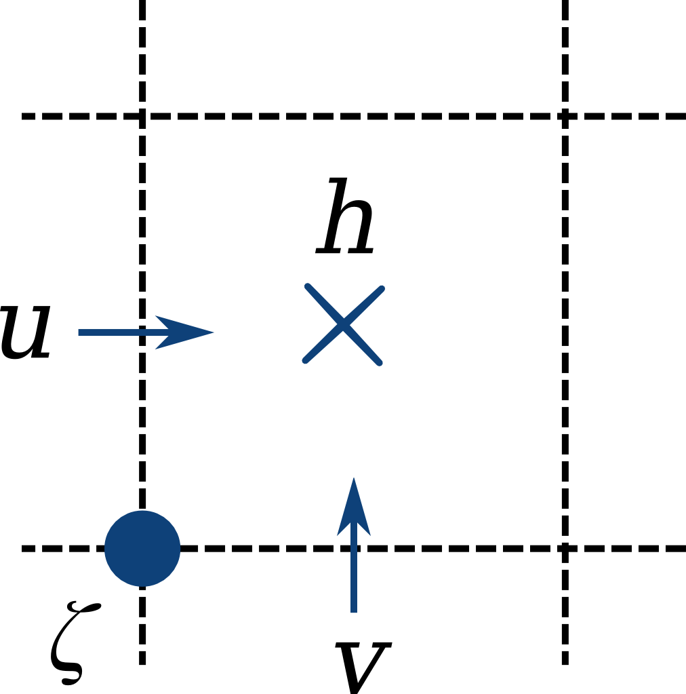

About Aronnax
********************

The Physics
============

Aronnax can run in two different modes:
- n + 1/2 layer mode, in which the bottom layer is quiescent and infinitely deep
- n layer mode, in whihc the bottom topography is specified and all layers have finite thickness

n + 1/2 layer mode
-------------------
This is very cheap to run

n layer mode
--------------------
More expensive

Governing Equations
=====================

The model solves the hydrostatic Boussinesq equations within a finite number of discrete isopycnal layers. At the layer interfaces there is a discrete jump in velocity and density, but not in pressure.

Continuity equation
-------------------
.. math::
    \label{eqn:reduced_gravity_layer_continuity} 
    \frac{\partial h_{n}}{\partial t} = \mathbf{\nabla} \cdot \left(h_{n} \mathbf{v_{n}} \right).

in which :math:`\mathbf{v_{n}}` represents the vertically averaged horizontal velocity in layer :math:`n`.

Momentum equations
-------------------
.. math::
    \label{eqn:reduced_grav_layer_1_momentum} 
    \frac{D \mathbf{v_{n}}}{D t} +  \mathbf{f} \times \mathbf{v_{n}} + g^{'}\mathbf{\nabla}h_{n} = \mathbf{F_{n}},

in which :math:`g^{'}` is the reduced gravity given by :math:`{g(\rho_{2} - \rho_{1})}/{\rho_{1}}`. The reduced gravity is dynamically equivalent to gravity, but is scaled to take into account the density difference between the two layers.

This can be rewritten in terms of the Bernoulli Potential to give,

.. math::
    \label{eqn:momentum_Bernoulli_form}
    \frac{\partial\mathbf{v_{n}}}{\partial t} - (f+\zeta_{n}) \times v_{n} + \nabla \Pi_{n} + = \kappa \nabla^{2}v_{n} + \frac{\mathbf{F_{n}}}{\rho_{0}}

where :math:`\Pi_{n}` is the Bernoulli potential, :math:`\left(\mathbf{v_{n}}\cdot\mathbf{v_{n}}\right)/2 + p/\rho_{0}`, and :math:`p` is the hydrostatic pressure. In this form the non-linearity from the material derivative has been moved into the Bernoulli Potential and the vorticity term. 

The model can be used in either reduced gravity mode, with a quiescent abyss, or in n-layer mode with bathymetry. In the n-layer case the model can either be run with a rigid lid, or with a free surface. In simulations with a free surface the following equation is also solved

.. math::
    \label{eqn:}
    \frac{\partial \eta}{\partial t} + \mathbf{\nabla} \cdot (H \mathbf{V}) = 0,

where :math:`H` is the depth from the free-surface to the bathymetry, and :math:`V` is the vertically averaged flow, the barotropic flow. With a rigid lid, the model solves an analogous equation, but it is just for the pressure field to keep the vertically integrated horizontal flow divergence free - the result is not carried from one timestep to the next.

Discretisation
===============
Aronnax is discretised on an Arakawa C grid.

   A single grid cell from an Arakawa C grid.

Numerical algorithm
====================
The model solves for two horizontal velocity components and layer thickness in an arbitrary number of layers. The model supports two sets of physics: either a reduced gravity configuration in which the horizontal pressure gradient is set to zero in a quiescent abyss below the lowest active layer; or an n-layer configuration in which bathymetry must be specified.

MIM is discretised on an Arakawa C-grid, with the velocity and thickness variables in different locations on the grid cell.

The choice of quiescent abyss or n-layer physics is made by a runtime parameter in the input file. The numerical algorithm for calculating the values at the next time level, :math:`n+1`, is as follows:

  - The Bernoulli Potential is calculated using values from time-level :math:`n`
  
    - The function used depends on whether the model is running in reduced gravity mode or n-layer mode
  
  - The relative vorticity is calculated using values from time-level :math:`n`
  - The layer thickness tendencies are calculated using the velocities and layer thicknesses from time-level :math:`n`
  - the velocity tendencies are calculated using values from time-level :math:`n`
  - the layer thicknesses and velocities are stepped forward in time to :math:`n+1` using a third-order Adams-Bashforth algorithm and the stored time derivatives from the previous two timesteps. N.B. for the n-layer version these velocities are not strictly at time :math:`n+1`, let's call it time level :math:`n+*`.
  - For the n-layer version:
  
    - The no-normal flow boundary condition is applied (perhaps unnecessary?)
    - The barotropic velocity required to keep the vertically integrated flow non-divergent in the horizontal is calculated and added to the baroclinic velocities calculated previously
    
      - the barotropic velocities are calculated from the velocities at time-level :math:`n+*`.
      - the divergence of these velocities is used to solve for the free surface elevation at time-level :math:`n+1` that makes the barotropic flow non-divergent
      
        - This is the step that requires the matrix inversion, since we solve the equation implicitly to sidestep the issue of requiring a *very* short :math:`\delta t`.
      
      
      - the barotropic correction is applied to the velocity fields
      - consistency between the sum of the layer thicknesses and the depth of the ocean is forced by applying a uniform inflation/deflation to the layers. (the model currently prints a warning if the discrepancy is larger than a threshold - currently 1\%?)
    
  
  - The no normal flow and tangential (no-slip or free-slip) boundary conditions are applied
  - The layer thicnkesses are forced to be larger than some user-specified minimum. This is for numerical stability and is probably only necessary for the layer receiving the wind forcing. (This is a limitation I would like to remove, it's what we are discussing in ticket [\#26](https://github.com/edoddridge/aronnax/issues/61)
  - the arrays are shuffled to prepare for the next timestep.

N.B. To get the model going, two time steps are initially performed using Runge-Kutta 4th order time stepping.
