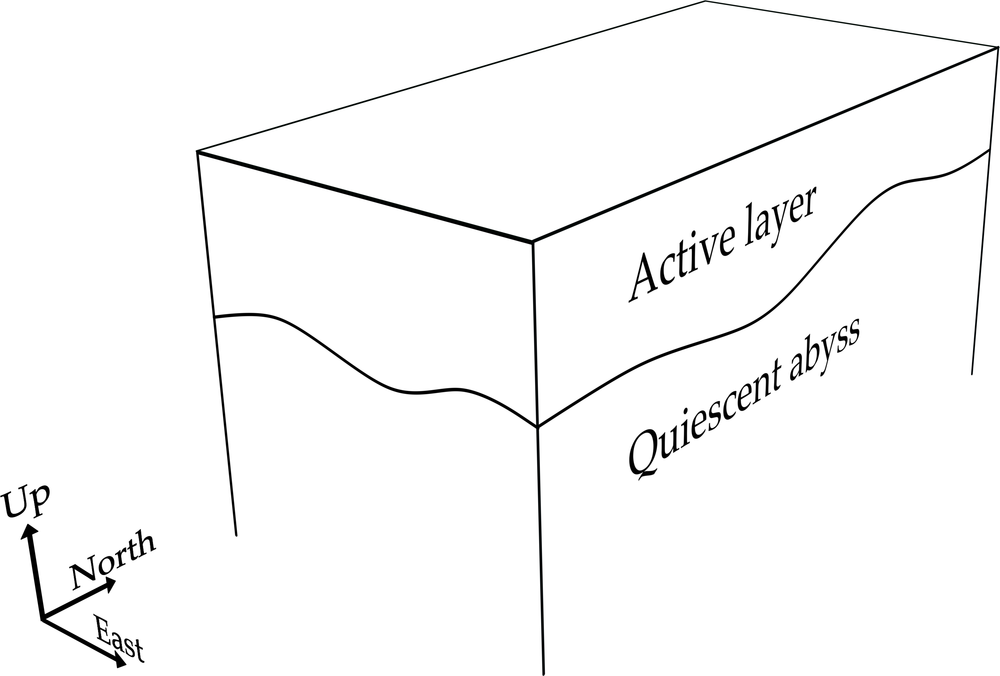

The Aronnax Model
********************

The Physics
============

Aronnax can run in two different modes:

- n + 1/2 layer mode, in which the bottom layer is quiescent and infinitely deep
- n layer mode, in which the bottom topography is specified and all layers have finite thickness

n + 1/2 layer mode
-------------------

The n + 1/2 layer mode is very cheap to run: Each time-step takes time
linear in the number of grid points.

n layer mode
--------------------

The n layer mode is more expensive, because the integration method is
party implicit (to wit, solves a system of equations to ensure
non-divergence of the barotropic flow).  This tends to cost an extra
factor of one grid side length in the run time, but admits a more
realistic simulation, in that the effect of the ocean floor is
included.

Governing Equations
=====================

The model solves the hydrostatic Boussinesq equations within a finite number of discrete isopycnal layers. At the layer interfaces there is a discrete jump in velocity and density, but not in pressure. The general forms of the equations are shown in :numref:`sub_continuity_eqn` and :numref:`sub_momentum_equations`, while a derivation of these equations for the 1.5 layer version of the model is shown in :numref:`sub_reduced_gravity_equations`.

.. _sub_continuity_eqn:

Continuity equation
-------------------
.. math::
    \frac{\partial h_{n}}{\partial t} = \mathbf{\nabla} \cdot \left(h_{n} \mathbf{v_{n}} \right).
    :name: eqn_layerwise_continuity

in which :math:`h_{n}` is the thickness of layer :math:`n`, and :math:`\mathbf{v_{n}}` represents the vertically averaged horizontal velocity in layer :math:`n`.

.. _sub_momentum_equations:

Momentum equations
-------------------
.. math::
    \frac{D \mathbf{v_{n}}}{D t} +  \mathbf{f} \times \mathbf{v_{n}} + g^{'}\mathbf{\nabla}h_{n} = \mathbf{F_{n}},
    :name: eqn_layerwise_momentum

in which :math:`g^{'}` is the reduced gravity given by :math:`{g(\rho_{2} - \rho_{1})}/{\rho_{1}}`. The reduced gravity is dynamically equivalent to gravity, but is scaled to take into account the density difference between the two layers.

This can be rewritten in terms of the Bernoulli Potential to give,

.. math::
    \frac{\partial\mathbf{v_{n}}}{\partial t} - (f+\zeta_{n}) \times v_{n} + \nabla \Pi_{n} + = \kappa \nabla^{2}v_{n} + \frac{\mathbf{F_{n}}}{\rho_{0}}
    :name: eqn_momentum_Bernoulli_form

where :math:`\Pi_{n}` is the Bernoulli potential, :math:`\left(\mathbf{v_{n}}\cdot\mathbf{v_{n}}\right)/2 + p/\rho_{0}`, and :math:`p` is the hydrostatic pressure. In this form the non-linearity from the material derivative has been moved into the Bernoulli Potential and the vorticity term. 

The model can be used in either reduced gravity mode, with a quiescent abyss, or in n-layer mode with bathymetry. In the n-layer case the model can either be run with a rigid lid, or with a free surface. In n-layer simulations the following equation is also solved

.. math::
    \frac{\partial \eta}{\partial t} + \mathbf{\nabla} \cdot (H \mathbf{V}) = 0,
    :name: eqn_n_layer_eta

where :math:`\eta` is the free surface height, :math:`H` is the depth from the free-surface to the bathymetry, and :math:`V` is the vertically averaged flow, the barotropic flow. With a rigid lid :math:`\eta` represents the pressure field required to keep the vertically integrated horizontal flow divergence free - the result is not carried from one timestep to the next.

.. _sub_reduced_gravity_equations:

Reduced gravity equations
-------------------------

The most idealised version of Aronnax is a 1.5 layer or ‘reduced
gravity’ model. Reduced
gravity models are often referred to as 1.5 layer models because of the
limited dynamics in the lowest layer. The bottom layer is assumed to
have no motion, which is mathematically equivalent to an infinite
thickness. Since there is no motion in the lowest layer, the model is
unable to support vertically homogeneous, or barotropic, motions. This
means that the gravest mode supported by the model is the first
baroclinic mode. This version of Aronnax also features a rigid lid
to remove surface gravity waves from the model solutions. This allows
for longer time steps in the numerical solver. Reduced gravity models
are often used to model the dynamics of the upper ocean, with the
interface between the layers taken as an approximation for the oceanic
thermocline. A schematic of a 1.5 layer model is shown in :numref:`reduced_grav_schematic`.

The equations for a model with one active layer above a quiescient abyss
will be derived here. Extending the derivation to a model with :math:`n`
active layers requires substantially more algebra but gives little
additional insight.

   Schematic of a reduced gravity model in a rectangular domain. The
   fluid within the infinitely deep, quiescent abyss is assumed to be at
   rest.

If we take the conservation of mass and recast it as conservation of mass in a layer of thickness :math:`h`
we get

.. math::
   \frac{D\left(\rho h\right)}{Dt} + \rho h \mathbf{\nabla} \cdot \mathbf{V} = 0,
   :name: eqn_layer_continuity_proto

in which :math:`\mathbf{V}` represents the vertically averaged horizontal
velocity in the layer, and :math:`\rho h` is the areal density. By
expanding the material derivative, combining terms and assuming that
:math:`\rho` is constant within an isopycnal layer, :eq:`eqn_layer_continuity_proto` can be rewritten as

.. math::
   \frac{\partial h}{\partial t} = \mathbf{\nabla} \cdot \left(h\mathbf{V}\right).
   :name: eqn_reduced_gravity_layer_continuity

With a rigid lid the surface is maintained at a constant height of zero,
but the pressure is unconstrained. If we let the pressure at the rigid
lid be given by :math:`P(x,y,t)`, then the pressure in the upper layer
at depth :math:`z` is

.. math::
  P_{1}\left(x,y,z,t\right) = P\left(x,y,t\right) - \rho_{1}gz,
  :name: eqn_reduced_grav_layer_1_pressure 

where :math:`\rho_{1}` is the density of the upper layer, :math:`z` is
the vertical coordinate which becomes more negative with depth. A
defining feature of reduced gravity models is the absence of motion in
the lowest layer. This means that the horizontal pressure gradients in
layer 2 are identically zero, which we can use to solve for the
interface displacement. The pressure in layer 2 is given by

.. math::
    P_{2}(x,y,z,t) = P_{1}(x,y,h,t) - \rho_{2}g(z+h) = P + \rho_{1}gh + \rho_{2}g(z+h),
    :name: eqn_reduced_grav_layer_2_pressure 

where :math:`h` is the thickness of the upper layer. Since a central
assumption of the reduced gravity framework is that the horizontal
gradients of :math:`P_{2}` are zero we can now solve for the horizontal
pressure gradient in the upper layer. Taking the gradient of equation
:eq:`eqn_reduced_grav_layer_2_pressure` and setting the left-hand side to
zero gives

.. math::
    0 = \mathbf{\nabla} P + \mathbf{\nabla}\rho_{1}gh + \mathbf{\nabla}\rho_{2}g(-h),
    :name: eqn_reduced_grav_pressure_grad_proto 

which can be rearranged to give

.. math::
    \mathbf{\nabla}P = g(\rho_{2} - \rho_{1}) \mathbf{\nabla}h,
    :name: `eqn_reduced_grav_pressure_grad 

which relates the horizontal pressure gradients in the upper layer to
displacements of the interface. The momentum equation for the upper
layer is therefore

.. math::
    \frac{D\mathbf{V}}{Dt} +  \mathbf{f} \times \mathbf{V} + g^{'}\mathbf{\nabla}h = \mathbf{F},
    :name: eqn_reduced_grav_layer_1_momentum 

in which :math:`g^{'}` is the reduced gravity given by
:math:`{g(\rho_{2} - \rho_{1})}/{\rho_{1}}`. The reduced gravity is
dynamically equivalent to gravity, but is scaled to take into account
the density difference between the two layers.

Discretisation
===============
Aronnax is discretised on an Arakawa C grid.

.. figure:: _static/C-grid.png
   :alt: Arakawa C grid
   :width: 33%
   :align: center

   A single grid cell from an Arakawa C grid.

Numerical algorithm
====================
The model solves for two horizontal velocity components and layer thickness in an arbitrary number of layers. The model supports two sets of physics: either a reduced gravity configuration in which the horizontal pressure gradient is set to zero in a quiescent abyss below the lowest active layer; or an n-layer configuration in which bathymetry must be specified.

Aronnax is discretised on an Arakawa C-grid, with the velocity and thickness variables in different locations on the grid cell.

The choice of quiescent abyss or n-layer physics is made by a runtime parameter in the input file. The numerical algorithm for calculating the values at the next time level, :math:`n+1`, is as follows:

  - The Bernoulli Potential is calculated using values from time-level :math:`n`
  
    - The function used depends on whether the model is running in reduced gravity mode or n-layer mode
  
  - The relative vorticity is calculated using values from time-level :math:`n`
  - The layer thickness tendencies are calculated using the velocities and layer thicknesses from time-level :math:`n`
  - the velocity tendencies are calculated using values from time-level :math:`n`
  - the layer thicknesses and velocities are stepped forward in time to :math:`n+1` using a third-order Adams-Bashforth algorithm and the stored time derivatives from the previous two timesteps. N.B. for the n-layer version these velocities are not strictly at time :math:`n+1`, let's call it time level :math:`n+*`.
  - For the n-layer version:
  
    - The no-normal flow boundary condition is applied (perhaps unnecessary?)
    - The barotropic velocity required to keep the vertically integrated flow non-divergent in the horizontal is calculated and added to the baroclinic velocities calculated previously. To do this:
    
      - the barotropic velocities are calculated from the velocities at time-level :math:`n+*`.
      - the divergence of these velocities is used to solve for the free surface elevation at time-level :math:`n+1` that makes the barotropic flow non-divergent
      
        - This is the step that requires the linear system solve, since we solve the equation implicitly to sidestep the issue of requiring a *very* short :math:`\delta t`.
      
      
      - the barotropic correction is applied to the velocity fields
      - consistency between the sum of the layer thicknesses and the depth of the ocean is forced by applying a uniform inflation/deflation to the layers. (the model currently prints a warning if the discrepancy is larger than a configurable threshold, which defaults to 1\%)
    
  
  - The no normal flow and tangential (no-slip or free-slip) boundary conditions are applied
  - The layer thicnkesses are forced to be larger than a configurable minimum. This is for numerical stability and is probably only necessary for the layer receiving the wind forcing. This is discussed in ticket `#26 <https://github.com/edoddridge/aronnax/issues/26>`_
  - the arrays are shuffled to prepare for the next timestep.

N.B. To get the Adams-Bashforth method going, two time steps are initially performed using Runge-Kutta 4th order time stepping.
