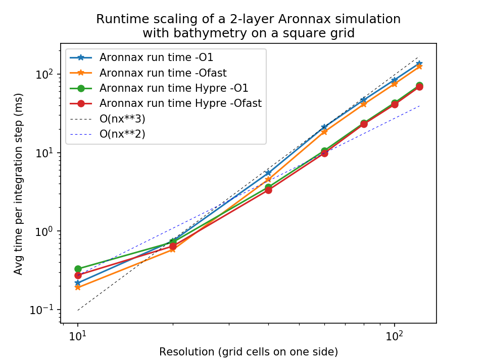
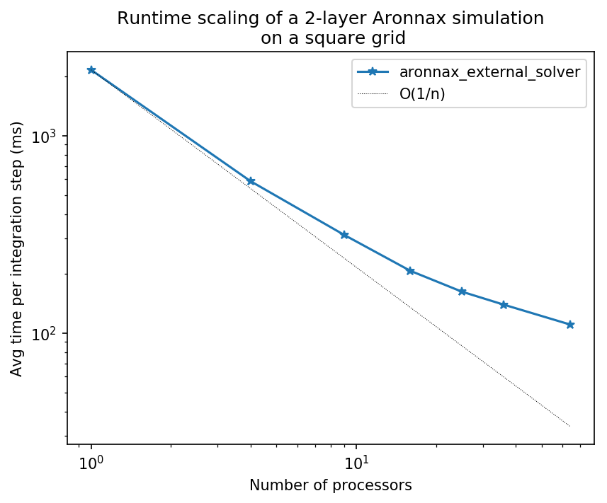
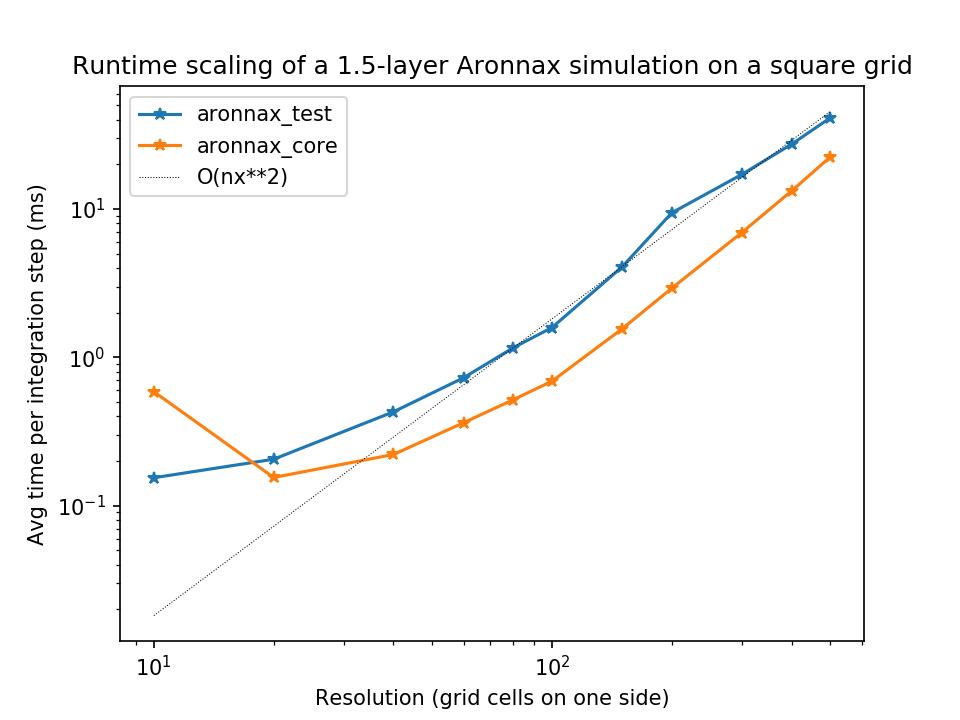
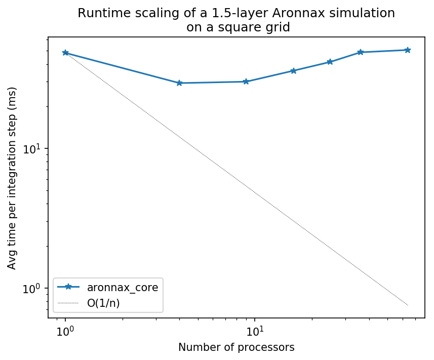

.. _benchmarking:

Benchmarking
************************

Aronnax runs in two different modes. These two modes have
substantially different runtimes due to the equations being solved.

These benchmarks can be reproduced by running the `benchmark.py` script in the `benchmarks/` directory. Be warned, it takes a while to run the full thing.

n-layer mode
==========================
Because it requires a linear equation solve at every timestep, including the ocean
floor leads to substantially more expensive simulations.

   n-layer runtime scaling with resolution.  These data are
   timings of different 500-step simulations of a Gaussian depth bump
   evolving in a :math:`\beta`-plane approximation to the Earth's
   curvature, with different resolutions.

   n-layer runtime for a 480x480x2 layer simulation scaling with number of processors.
   The speed increase with additional processors is not linear, but it
   is is noticeable.

Reduced gravity mode
========================
The reduced gravity mode is substantially faster than the n-layer mode.

   Reduced-gravity runtime scaling with resolution.  These data are
   timings of different 500-step simulations of a Gaussian depth bump
   evolving in a :math:`\beta`-plane approximation to the Earth's
   curvature, with different resolutions.

   Reduced-gravity runtime for a 480x480x1.5 layer simulation scaling with number of processors. 
   As you can see, it's not great; your mileage may vary.
   Luckily, this mode is already very fast.

