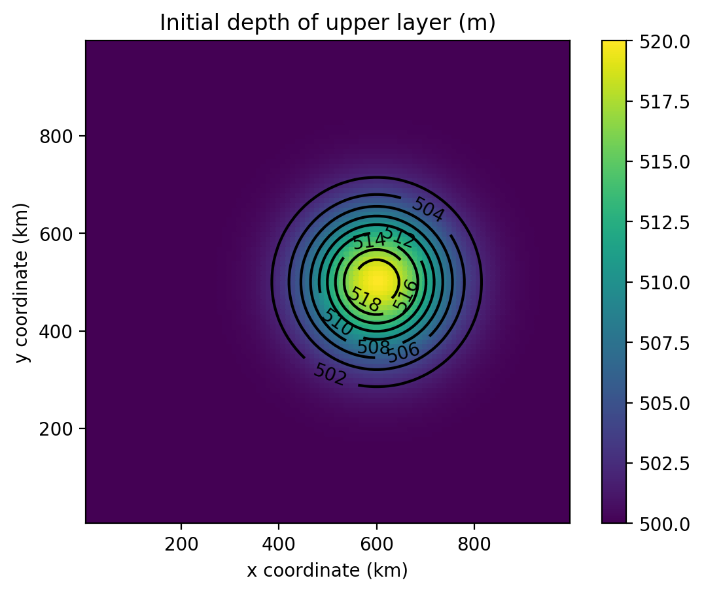
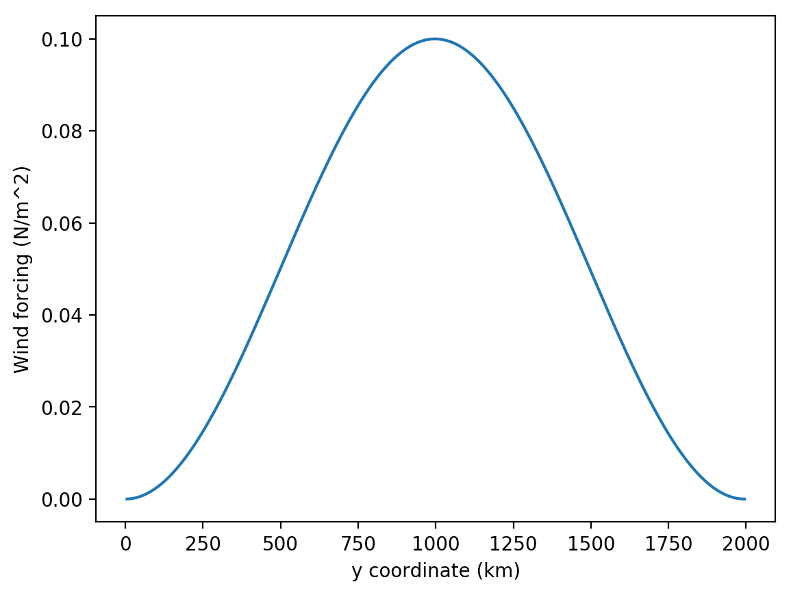
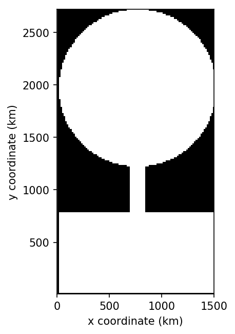
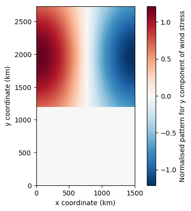
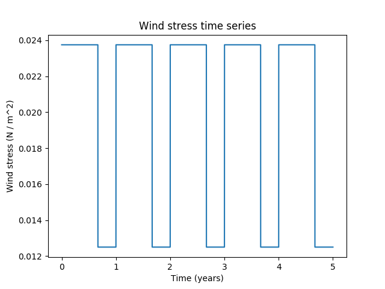
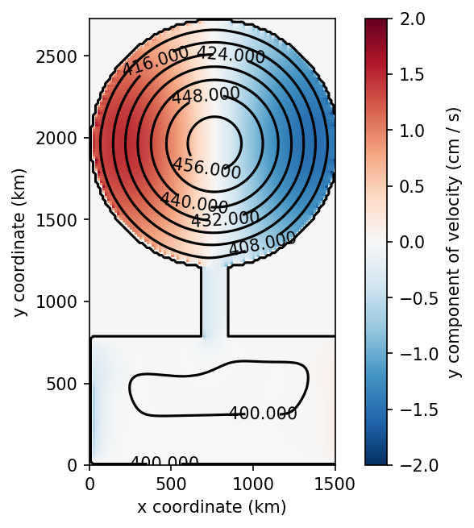
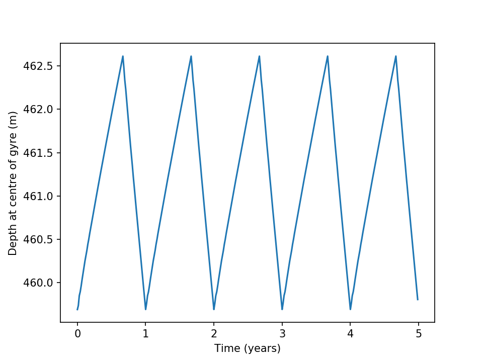
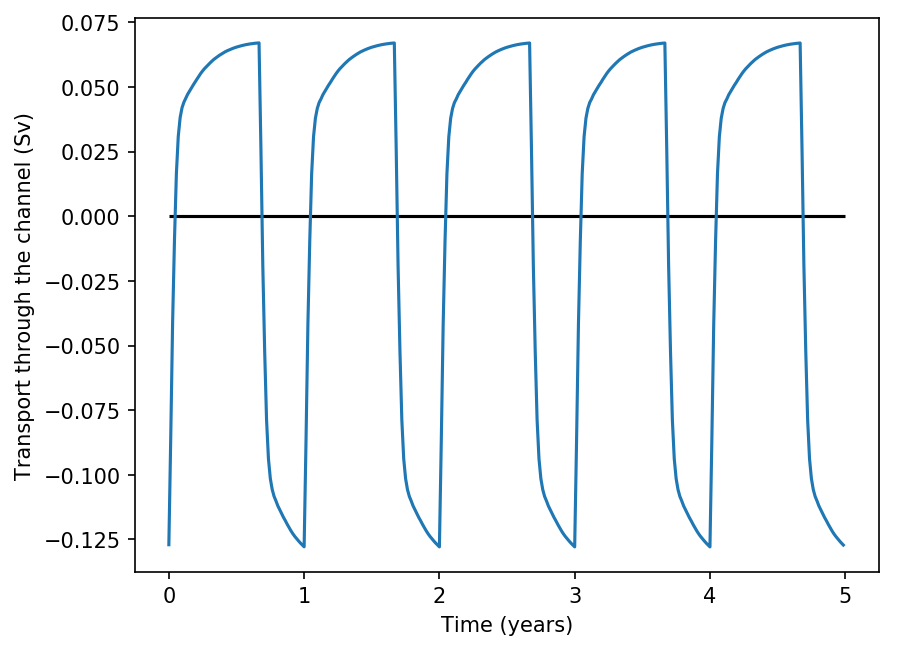

Examples
************************

In the following sections we present some simplified examples and use Aronnax to reproduce a number of published results to show how Aronnax can be easily configured for a range of idealised modelling studies.

Canonical examples
===================

These simulations use simple domains and and inputs. They highlight some of the features available in Aronnax and can be found in the `examples/` folder. To run these simulations locally change into the `examples/` directory and execute `python run_examples.py` in the terminal.

Gaussian bump on a :math:`\beta`-plane
----------------------------------------

This example is initialised with a Gaussian bump in the layer thickness field. The momentum forcing is set to zero. The initial thickness of the upper layer for both examples is shown in :numref:`fig_GbumpIC`.

   Initial thickness of the upper layer for the Gaussian bump examples

1 + 1/2 layers
+++++++++++++++

.. figure:: ../examples/reduced_gravity/beta_plane_bump/figures/red-grav-bump.*
   :width: 75%
   :align: center
   :alt: 1.5 layer example initialised with a Gaussian bump

   Evolution of a Gaussian bump on a 1.5 layer :math:`\beta`-plane.

2 layers
+++++++++++

The upper layer of a two-layer simulation with a flat bottom. This looks very similar to the 1.5 layer simulation.

.. figure:: ../examples/n_layer/beta_plane_bump/figures/n-layer-bump.*
   :width: 75%
   :align: center
   :alt: 2 layer example initialised with a Gaussian bump

   Evolution of a Gaussian bump on a 2 layer :math:`\beta`-plane.

Twin gyre on a :math:`\beta`-plane
-------------------------------------

These two examples begin with closed rectangular domains that are initially at rest. The momentum forcing shown in :numref:`fig_twingyre_zonal_wind` is applied to the upper layer in both examples. Due to it's computational complexity the :math:`n` layer configuration takes substantially longer to run than the :math:`n+1/2` layer simulation.

   Zonal wind forcing applied to twin gyre simulations.

The twin gyre simulations are run on a 10 km resolution :math:`\beta`-plane with Coriolis parameters equivalent to the midlatitudes of the Northern Hemisphere. At these latitudes 10 km is an eddy resolving resolution, and we expect to see inertial recirculations and internal variability develop as the simulations spin up.

1 + 1/2 layers
+++++++++++++++

This example simulates a twin-gyre on a :math:`\beta`-plane with 1 active layer above a quiescent abyss. This simulation runs for almost 140 days of model time, and clearly shows the development of the two gyres and inertial recirculations at the inter-gyre boundary.

.. figure:: ../examples/reduced_gravity/beta_plane_gyre/figures/red-grav-twin-gyre.*
   :width: 75%
   :align: center
   :alt: twin-gyre on a 1.5 layer beta-plane

   Evolution of a twin-gyre on a 1.5 layer :math:`\beta`-plane.

2 layers
+++++++++++

This is also a twin-gyre simulation, but is run with :math:`n` layer physics and a flat bottom. Once again the simulation runs for almost 140 model days and clearly shows the development of two gyres, western boundary currents, and inertial recirculation regions.

.. figure:: ../examples/n_layer/beta_plane_gyre/figures/n-layer-twin-gyre.*
   :width: 75%
   :align: center
   :alt: twin-gyre on a 2 layer beta-plane

   Evolution of a twin-gyre on a 2 layer :math:`\beta`-plane.

Reproducing published results
===============================

These examples show how Aronnax can be used to reproduce results from the literature.

Davis et al. (2014) - An idealised Beaufort Gyre
-------------------------------------------------
`Davis et al. (2014) <http://dx.doi.org/10.1175/JCLI-D-14-00090.1>`_ used a reduced gravity model to explore the response of an idealised Beaufort Gyre to changes in the seasonal cycle of wind stress. Here we reproduce their control simulation. The domain is set up as a lollipop, with a circular basin for the Beaufort Gyre and a narrow channel connecting it to a region with sponges.

   The computational domain for Davis et al. (2014). Note: the domain is symmetric, it is the plotting command that makes it look asymmetric.

Over this lollipop basin a wind stress is used to drive an anticyclonic circulation. The magnitude of the wind stress is given as

.. math::
  \frac{1}{r}\int{r \cos^{2}(r)} dr

which is multiplied by :math:`\sin(\theta)` or :math:`-\cos(\theta)` to give the x and y components of the wind stress. Converting the integral into the wind stress requires evaluating :math:`1/r` times the integral as 

.. math::
  \frac{1}{r} \left(\frac{r \sin(2r)}{4} - \frac{\sin^{2}(r)}{4} + \frac{r^{2}}{4}\right)

and normalising the result such that the average wind stress magnitude inside the circular domain is equal to one. This normalised wind stress is then converted into its x and y components.

The y component of the normalised wind stress field is shown on the left, and the time series of wind stress magnitude is on the right.

After integrating for 40 model years these inputs produce a steady seasonal cycle in velocity and layer thickness. A snap shot is shown on the left, while a time series of the maximum thickness is shown on the right.

The seasonal cycle in layer thickness requires a time varying transport through the channel. This is shown below.

   Time series of transport through the channel due to the seasonal cycle in wind stress.

The paper includes multiple experiments perturbing the seasonal cycle of wind stress. Reproducing the perturbation experiments would require modifying the input variable `wind_mag_time_series_file`.

.. Note:: The configuration used to create these outputs can be found in the reproductions folder of the repository.

Manucharyan and Spall (2016)
-----------------------------
n-layer configuration looking at eddies in the Arctic. (The original experiment was run using a z-level model, but it could also be done in an isopycnal model)

Johnson and Marshall (2002)
----------------------------
Reduced gravity analysis of the adjustment of the MOC to changes in deep water formation rates.
