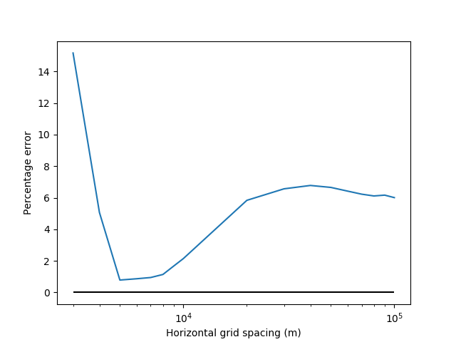
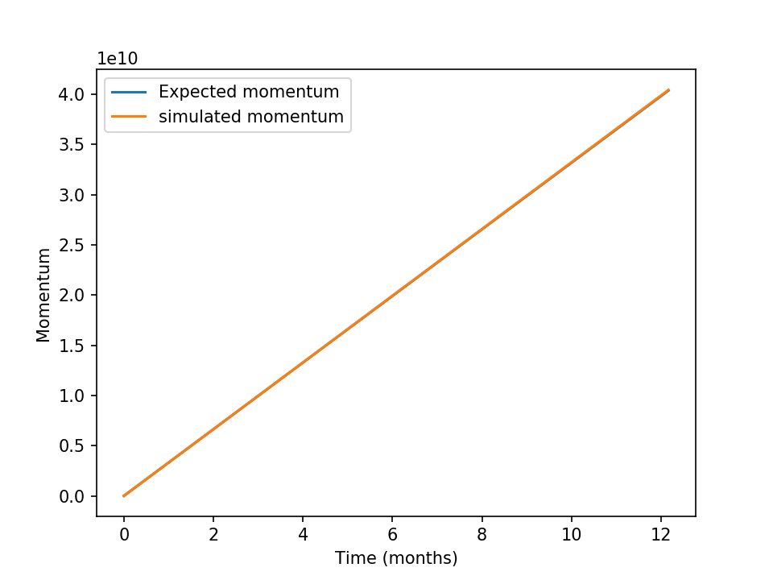
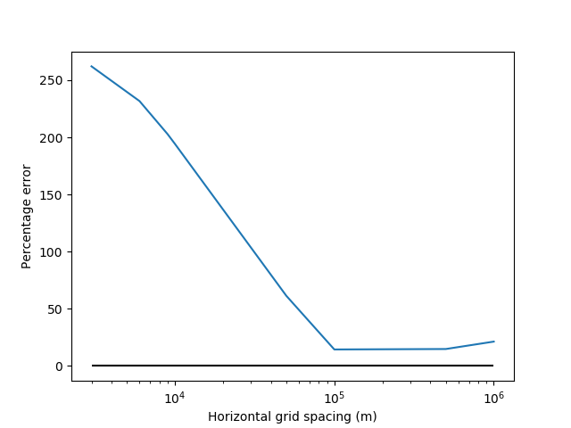
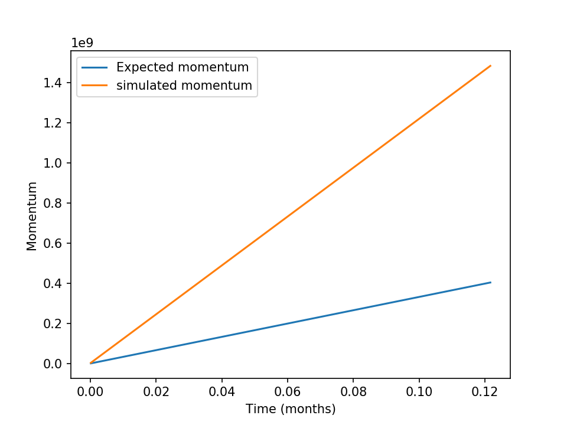
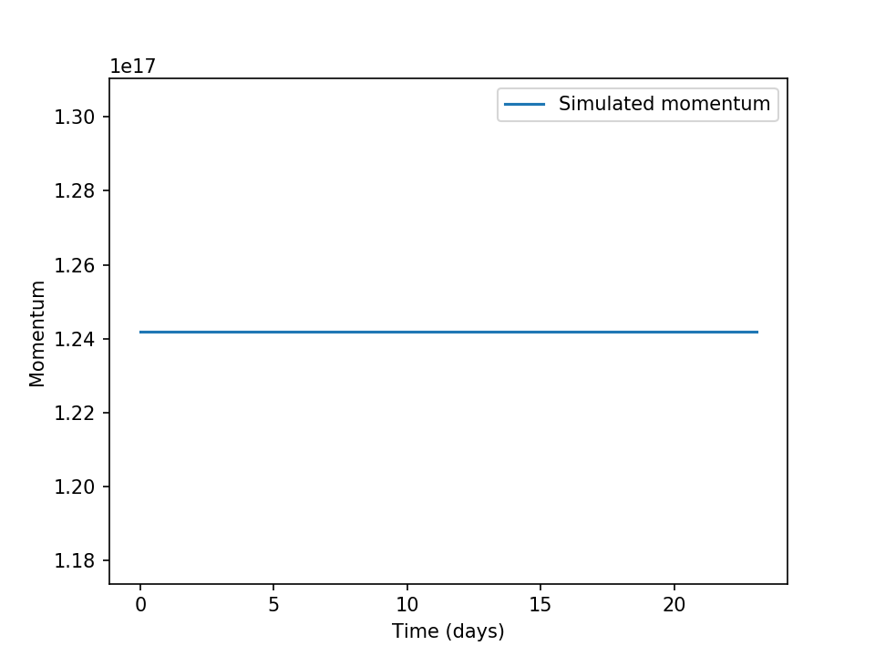

Verification
************************

Aronnax includes a number of diagnostic test to verify that the numerical core is satisfactorily solving the equations of motion.

Conservation of volume
========================

The use of sponge regions affects volume conservation in both global and layerwise sense, depending on the configuration. The following table shows when global or layerwise volume conservation can be expected.

+------------------+-----------------+----------------------+
| Physics          | Sponge regions? | Volume conservation  |
+------------------+-----------------+----------+-----------+
|                  |                 |  Global  | Layerwise |
+==================+=================+==========+===========+
| n-layer          |       Yes       |  Yes     | No        |
+------------------+-----------------+----------+-----------+
| n-layer          |       No        |  Yes     | Yes       |
+------------------+-----------------+----------+-----------+
| n + 1/2 layer    |       Yes       |  No      | No        |
+------------------+-----------------+----------+-----------+
| n + 1/2 layer    |       No        |  Yes     | Yes       |
+------------------+-----------------+----------+-----------+

TODO:
- Add graphs of layerwise/global volume in simulations with(out) sponges

Momentum forcing
==========================

The verification suite runs an ensemble of simulations with different horizontal resolutions to assess the impact of resolution on the treatment of momentum within the model. These simulations are started from rest and a single grid point in the centre of the doubly periodic domain is subjected to a small wind forcing. The model is then integrated forward in time with all explicit viscosity and drag parameters set to zero. The difference between the simulated momentum and the expected momentum provides a measure of how well the model treats momentum.

All of the simulations are integrated for one model year using the same value for :math:`\delta t`. This prevents variation due integrating for different amounts of model time or using different timesteps.

Reduced gravity mode
+++++++++++++++++++++++++++++++++

The magnitude of the error varies with :math:`\delta x`, suggesting it is likely due to truncation error - the error induced by solving a continuous set of equations on a discrete grid.

   Momentum error as a function grid size for simulations using the reduced gravity mode.

The evolution of momentum in the 8 km resolution test simulation using reduced gravity physics.

   Momentum evolution as a function of time at 8 km resolution in the reduced gravity configuration. The two lines are indistinguishable.

n-layer mode
+++++++++++++++++++++++++++++++++
When running in the n-layer mode the momentum discrepancy is much larger and exhibits different variation with :math:`\delta x`. 

   Momentum error as a function grid size for simulations using the n-layer mode.

The evolution of momentum in the 8 km resolution test simulation using n-layer physics. The simulated momentum increases linearly, as expected, but the slope is much too large - the model obtains more momentum from the wind forcing than expected.

   Momentum evolution as a function of time at 8 km resolution in the n-layer configuration.

Momentum convservation
======================

The verification suite also runs simulations to assess how well the model conserves momentum. Once again all explicit drag parameters have been set to zero. The Coriolis parameter has also been set to zero to remove inertial oscillations and allow for a cleaner test.

In both the n-layer and reduced gravity modes the model conseres the initial momentum, as shown in :numref:`fig_n_layer_init_u_momentum` and :numref:`fig_red_grav_init_u_momentum`.

.. figure:: ../test/physics_tests/f_plane_n_layer_init_u/f_plane_momentum_test.png
   :alt: momentum time series from an unforced n-layer simulation
   :name: fig_n_layer_init_u_momentum

   A time series of momentum from an unforced n-layer simulation with non-zero initial conditions.

   A time series of momentum from an unforced reduced gravity simulation with non-zero initial conditions.
